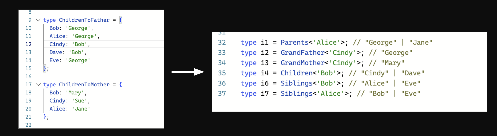

# Typescript challenge

In this challenge, you’ll dive deep into the world of family relationships, unraveling the complex web of connections that bind our fictional family together. Your mission is to create TypeScript types that accurately describe various family relationships based on the provided data. You’ll be given information about parents and their children, and your goal is to implement types that can represent relationships such as siblings, parents, grandparents, and maybe more

